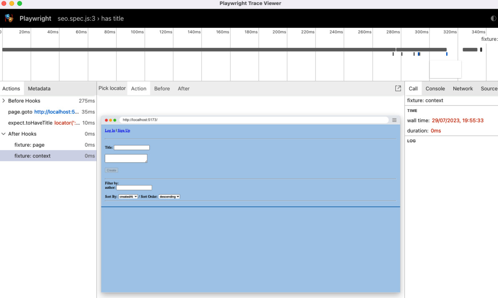

## End to End Testing with Playwright
First, we set up Playwright in our project and VS Code to allow for running frontend tests. Then, we are going to write some frontend tests for our application. Next, we are going to learn about reusing test setups with fixtures. Finally, we are going to learn how to view test reports and run Playwright in CI using GitHub Actions.

# Setting up playwright
Playwright is a test runner to facilitate end-to-end testing on various web rendering engines, such as
Chromium (Chrome, Edge, Opera, etc.), WebKit (Safari), and Firefox. It can run tests on Windows,
Linux, and macOS, locally or on CI.
There are two ways to run playwright:
1. Headed: Opens a browser window where it can be seen what Playwright is doing
2. Headless: Runs the rendering engine in the background and only displays the results of the tests in the Terminal or a generated test report

To install playwright run the following command
$ npm init playwright@1.17.131

When asked if you want to proceed with installing the create-playwright package, press Return/Enter to confirm it. Then select JavaScript. As for the directory name, keep the tests default name and press Return/Enter to confirm it. Type y to add a GitHub Actions workflow. Type y again to install Playwright browsers. It will now take a while to download and install the different browser engines.
To prepare the backend for end-to-end testing, we need to start an instance of the backend with the in-memory MongoDB server, similarly to what we did for the Jest tests. Let’s do that now:
To demonstrate we will create a e2e.js file inside our folder

# Using the VS Code extension
Instead of manually running all tests via the command line, we can also run specific tests (or all tests)
using a VS Code extension.
The extension also allows us to get a visual overview of which tests are succeeding (or not), allows us to inspect tests while running in a browser, and can even record our interactions in the browser and generate tests from it!
To do so:
1.Open the Extensions tab in VS Code and search for Playwright.
2.Click the Install button to install Playwright Test for VS Code by Microsoft.
3.Click on the Testing tab in VS Code (the flask icon), which we also used for the Jest extension. Here, you will now see Jest and Playwright in the list.
4.Expand the Playwright | tests path, click on seo.spec.js to load the file, and then click on the Play icon next to seo.spec.js to run the test.

# Showing browser while running the test
1. On the bottom of the Testing sidebar, check the Show browser box at the bottom of the sidebar
and run the test again.

A browser window will open and run the test. However, our test is very quick and simple, so it runs within a short amount of time and there is not much to see.

2. To better inspect the test, we can use the trace viewer. Check Show trace viewer at the bottom of the Testing sidebar and run the test again. You will see the following window open:

# Running test in the CI
When we initialized Playwright, we were asked if we want to generate a GitHub Actions CI file. We agreed, so Playwright automatically generated a CI configuration for us in the .github/workflows/ playwright.yml file. This workflow checks out the repository, installs all dependencies, installs Playwright browsers, runs all Playwright tests, and then uploads the report as an artifact so it can be viewed from the CI run. We still need to adjust the CI workflow to also install dependencies for our backend, so let’s do that now:
1.Edit .github/workflows/playwright.yml and add the following step to it:
      - name: Install dependencies
        run: npm ci
      - name: Install backend dependencies
        run: cd backend/ && npm ci
The npm ci command ensures that the project already has a package-lock.json file
and does not write a lock file, ensuring a clean state for CI to run on.
2.Add, commit, and push everything to a GitHub repository to see Playwright running in CI.
3.Go to GitHub, click on the Actions tab, select the Playwright Tests workflow on the sidebar, and then click on the latest workflow run.
4.At the bottom of the run, there is an Artifacts section, which contains a playwright-report object that can be downloaded to view the HTML report.