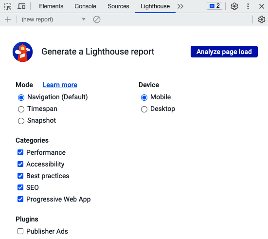

## Server Side Rendering
Here we will learn how to optimize the performance of an application and also different metrics of improving the load time

# Benchmarking load time of an application
Before we can get started improving the load time, we first must learn about the metrics to benchmark the performance of our application. The main metrics for measuring the performance of web applications are called Core Web Vitals, and they are as follows:
• First Contentful Paint (FCP): This measures the loading performance of an app by reporting the time until the first image or text block is rendered on the page. A good target would be to get this metric below 1.8 seconds.

• Largest Contentful Paint (LCP): This measures the loading performance of an app by reporting the time until the largest image or text block is visible within the viewport. A good target would be to get this metric below 2.5 seconds.

• Total Blocking Time (TBT): This measures the interactivity of an app by reporting the time between the FCP and a user being able to interact with the page. A good target would be to get this metric below 200 milliseconds.

• Cumulative Layout Shift (CLS): This measures the visual stability of an app by reporting unexpected movement on the page during loading, such as a link first being loaded on the top of the page, but then getting pushed further down to the bottom when other elements load.

While this metric does not directly measure the actual performance of the app, it is still an important metric to consider, as it can lead to annoying the users when they attempt to click on something, but the layout shifts.

All these metrics can be measured by using the open-source Lighthouse tool, which is also available from the Google Chrome DevTools under the Lighthouse panel.

WE will demonstrate using the following steps:
1. Run the frontend of the app using npm run dev
2. Go to http://localhost:5173 in Google Chrome and open the inspector (right-click and then press Inspect).
3. Open the Lighthouse tab (it might be hidden by the >> menu). It should look as follows:

4. In the Lighthouse tab, leave all options as their default settings and click on the Analyze page load button.

There are two reasons why the paint takes so long. Firstly, we are running the server in dev mode, which generally makes everything slower. Additionally, we are rendering everything on the client side, which means that the browser first must download and execute our JavaScript code before it can start rendering the interface. Let’s statically build our frontend and benchmark again now:
1. Install the serve tool globally with the following command, which is a tool that runs a simple
web server:
$ npm install -g serve

2. Build the frontend with this command (execute it in the root of our project):
$ npm run build

3. Statically serve our app by running the following command:
$ serve dist/

4. Open http://localhost:3000 in Google Chrome and run Lighthouse again (you may have
to clear the old reports or click the list in the top left and select (new report) to analyze again).

• In client-side rendering, the browser downloads a minimal HTML page, which, most of the time, only contains information on where to download a JavaScript bundle, which contains all the code that will render the app.

• In server-side rendering, the React components are rendered on the server and served as HTML to the browser. This ensures that the app can be rendered immediately. The JavaScript bundle can be loaded later.

Before we can get started with server-side rendering, we need to set up some boilerplate for running an Express server in tandem with Vite, so that we do not lose the benefits of Vite, such as hot reloading. Let’s follow these steps to set up the server:

Install the express and dotenv dependencies in the root of our project (the frontend); we are going to use them to create a small web server to serve our server-side rendered page:
$ npm install express@4.18.2 dotenv@16.3.1

Edit .eslintrc.json and add the node env, as we are going to add server-side code to our frontend now:
  "env": {
    "browser": true,
    "node": true
  },

  Next we will create a server.js file and import dependancies

The server-side entry point will use ReactDOMServer to render our React components on the
server. we will implement it in the file called entry-server.jsx

The client-side entry point uses regular ReactDOM to render our React components. However, we need to let React know to make use of the already server-side rendered DOM.
In the main.jsx replace the code with:

We still need to add the placeholder string to the index.html file and adjust package.json to
execute our custom server instead of the vite command directly. Let’s do that now:
1.
Edit index.html and add a placeholder where the server-rendered HTML will be injected:
    
<!--ssr-outlet-->

2.
Adjust the module import to point to the client-side entry point:
    
3.
Now, edit package.json and replace the dev script with the following:
    "dev": "node server",
4.
Additionally, replace the build command with commands to build the server and client:
    "build": "npm run build:client && npm run build:server",
    "build:client": "vite build --outDir dist/client",
    "build:server": "vite build --outDir dist/server --ssr src/
entry-server.jsx",

