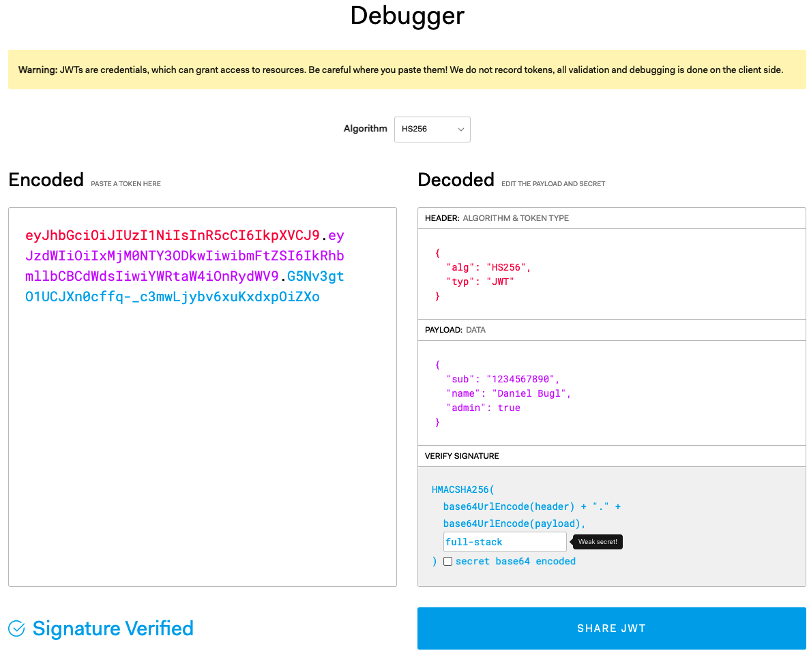

## Understanding Authentication with JWT
JWT, pronounced “jot”, is an open industry standard (RFC 7519) for safely passing claims between multiple parties. Claims can be information about a certain party or object, such as the email address, user ID, and roles of a user.

JWTs consist of the following components:
• Header: Containing the algorithm and token type
• Payload: Containing the data/claims of the token
• Signature: For verifying that the token was created by a legit source

# JWT Header
{
  "alg": "HS256",
  "typ": "JWT"
}

# JWT Payload
The main part of the JWT is the payload, which contains all claims. Claims are information about an
entity (such as the user) and additional data. The JWT standard distinguishes between three types
of claims:
• Registered claims: These are predefined claims and it’s recommended that they’re set. They include information about the following:
‚ The issuer (iss), which is the entity that created the token.
‚ The expiration time (exp), which tells us when the token expires.
‚ The subject (sub), which tells us about the entity identified by the token (such as the user who generated the token during a login).
‚ The audience (aud), which tells us about the intended recipients of the token.
‚ The issued at time (iat), which tells us when the token was created.
‚ The not before time (nbf), which specifies a time before which the token is not valid yet.
‚ The JWT ID (jti), which provides a unique identifier for the JWT. It’s used to prevent JWTs from being replayed.
• Public claims: These are additional claims that are commonly used and shared across many services. A list of those can be found on the Internet Assigned Numbers Authority (IANA) website: https://www.iana.org/assignments/jwt/jwt.xhtml. If we want to store additional information, we should always consult this list first to see if we can use a standardized claim name.
• Private claims: These are custom-defined claims, which are neither registered nor public. If we need a special claim that isn’t defined yet, we can make a private claim that only our services will understand.

{
  "sub": "1234567890",
  "name": "Daniel Bugl",
  "admin": true
}

# JWT Signature
The final part of a JWT is its signature. The signature is what proves that all the information that we’ve
defined up until now has not been tampered with. The signature is created by taking the base64-
encoded header and payload, joining those strings with a period symbol, and using the specified
algorithm to sign it with a secret key:
HMACSHA256(
  base64UrlEncode(header) + "." + base64UrlEncode(payload),
  secret
)

# Creating a JWT
These are the steps followed when creating a JWT
1.Go to the https://jwt.io/ website and scroll down to the Debugger section.

HMACSHA256(
  base64UrlEncode(header) + "." + base64UrlEncode(payload),
  secret
)

2.Enter our previously defined header and payload.
3.Enter full-stack as the secret.
4.The encoded JWT should update on the fly as you’re changing the values.

The screen should be as shown below:

# Using JWT to create login and signup authentication
We will first create a schema in user.js file
Next we will implement the signup in the service folder/ user,js, but before that we need to install bcrypt
Next we will expose our signup service using routes, we will create a file called routes/user.js

All well, the next step is to create a login backend for the user, we will do it by adding login logic in the user files, but first we need to install jwtwebtoken
npm install 'jsonwebtoken'
We will also edit the route/user.js file to add login authentication for the user

Now that we have successfully created a valid JWT, we can start protecting routes. To do so, we are going to use the express-jwt library, as follows:
$ npm install express-jwt@8.4.1

We need to use a function for the secret because dotenv isn’t initialized at import time yet, so the environment variable will only be available later. Specifying the algorithms is required to prevent potential downgrade attacks.

## Add requireAuth to make sure the apps are protected
exmpl
app.post('/api/v1/posts', requireAuth, async (req, res) => {
)}

## Intergrating backend with the frontend
The last step we will integrate our backend with the frontend
First, we are going to learn how to implement multiple pages in a React app using React Router. Then, we are going to implement the signup UI and connect it to the backend. Afterward, we are going to implement a login UI, store the token in the frontend, and set up automatic redirects when we are successfully logged in. Finally, we are going to update the code for creating posts to pass the token in the Authorization header and properly access our authenticated route.

React Router is a library that allows us to manage routing in our app by defining multiple pages on different routes, just like what we have done in Express for API routes, but for the frontend! Let’s set up React Router:
$ npm install react-router-dom@6.21.0

